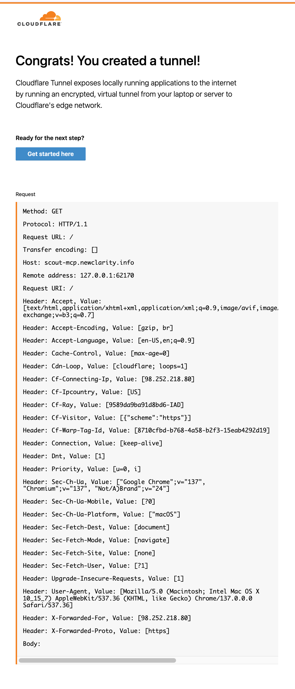

# CloudFlare Tunnel Setup Guide

This guide will walk you through setting up a CloudFlare tunnel to make Scout-MCP accessible to Claude through a secure, public URL.

## Prerequisites

- CloudFlare account (free tier works fine)
- Domain name managed by CloudFlare (or subdomain)
- `cloudflared` CLI tool installed

## Step 1: Check CloudFlare Dashboard Configuration

**Before proceeding, check if you've already configured tunnels through the web dashboard:**

1. Go to CloudFlare dashboard → Zero Trust → Networks → Tunnels
2. Check if you have existing tunnels configured with routes/DNS
3. **If you have existing tunnel configurations**: Delete the tunnel routes and DNS configurations from the dashboard to avoid conflicts
4. **If you have an existing tunnel without configuration**: You can keep the tunnel itself and configure it via CLI below

**Why this matters**: This guide uses CLI-only configuration which conflicts with dashboard settings. Dashboard configuration may create DNS routing issues with these commands.

## Step 2: Install CloudFlare Tunnel

**macOS (Homebrew):**
```bash
brew install cloudflare/cloudflare/cloudflared
```

**Linux (Debian/Ubuntu):**
```bash
# Download the latest release
wget -q https://github.com/cloudflare/cloudflared/releases/latest/download/cloudflared-linux-amd64.deb
sudo dpkg -i cloudflared-linux-amd64.deb
```

**Windows:**
Download from [CloudFlare's releases page](https://github.com/cloudflare/cloudflared/releases)

## Step 3: Authenticate with CloudFlare

```bash
cloudflared tunnel login
```

This opens your browser to authenticate with CloudFlare and downloads your **account certificate** (`cert.pem`).

**Note**: This is a **one-time setup** per machine. The credentials are stored locally and don't expire unless you revoke them in your CloudFlare dashboard. You only need to re-run this if:
- You're setting up on a new machine
- You've deleted your credentials files
- You've revoked the credentials in CloudFlare dashboard

## Step 4: Check or Create a Tunnel

```bash
# First, check if you already have tunnels
cloudflared tunnel list

# If you see an existing tunnel you want to use, note its name and ID
# If you need a new tunnel, create one:
cloudflared tunnel create scout-mcp

# Note the tunnel ID that's displayed - you'll need it for config
```

**Important Notes:**
- `tunnel create` generates **tunnel-specific credentials** (e.g., `TUNNEL_ID.json`) in addition to your account certificate
- Tunnels created via the web dashboard and CLI are the same - `cloudflared tunnel list` will show all tunnels
- If your tunnel name has spaces (like "Scout MCP Server"), use the tunnel ID in commands instead
- If you already created a tunnel through the CloudFlare website, you may need to run `tunnel create` to generate the credentials file, or you can use CLI flags instead

## Step 5: Configure DNS

**Check first**: If you created your tunnel through the web dashboard, DNS may already be configured. Check with:
```bash
nslookup scout-mcp.your-domain.com
```

If DNS is not configured, you can set it up via CLI or web dashboard:

**Option A: Via CLI (recommended)**
```bash
# Use tunnel ID (recommended, especially for names with spaces)
cloudflared tunnel route dns YOUR_TUNNEL_ID scout-mcp.YOUR_DOMAIN.com

# OR use tunnel name (quote if it contains spaces)
cloudflared tunnel route dns "Scout MCP Server" scout-mcp.YOUR_DOMAIN.com

# If DNS record already exists, use --overwrite-dns flag
cloudflared tunnel route dns --overwrite-dns YOUR_TUNNEL_ID scout-mcp.YOUR_DOMAIN.com
```

**Option B: Via CloudFlare Dashboard (if needed)**
1. Go to CloudFlare dashboard → DNS → Records
2. Click "Add record"
3. Select "CNAME" type
4. **Name**: `scout-mcp` (or your preferred subdomain)
5. **Target**: `YOUR_TUNNEL_ID.cfargotunnel.com`
6. Click "Save"

**Verification**: After configuration, verify with:
```bash
nslookup scout-mcp.your-domain.com
```

## Step 6: Create Tunnel Configuration (Optional)

**Recommended: Use CLI flags** (skip to Step 7)

For most users, CLI flags are simpler and less error-prone. However, if you prefer persistent configuration or need advanced settings, you can create a config file:

CloudFlare tunnel looks for configuration in these locations (in order):
1. `~/.cloudflared/config.yml` (default location)
2. `~/.config/cloudflared/config.yml` (XDG standard location)

**Create the config directory and file:**
```bash
# Using default location (recommended)
mkdir -p ~/.cloudflared
nano ~/.cloudflared/config.yml

# OR using XDG standard location
mkdir -p ~/.config/cloudflared
nano ~/.config/cloudflared/config.yml
```

**Configuration content:**
```yaml
tunnel: YOUR_TUNNEL_ID
credentials-file: ~/.cloudflared/YOUR_TUNNEL_ID.json

ingress:
  - hostname: scout-mcp.your-domain.com
    service: http://localhost:8080
  - service: http_status:404
```

**Replace:**
- `YOUR_TUNNEL_ID` with the tunnel ID from step 4 (e.g., `2de39b5b-02ca-42d0-a6b3-bc9e88baf39d`)
- `scout-mcp.your-domain.com` with your actual domain
- Port `8080` should match your Scout-MCP server port

**File structure explanation:**
- **Account certificate**: `~/.cloudflared/cert.pem` (from `tunnel login`)
- **Tunnel credentials**: `~/.cloudflared/TUNNEL_ID.json` (from `tunnel create`)
- The config file uses the **tunnel-specific JSON file**, not `cert.pem`

## Step 7: Test the Tunnel with Hello World

Before running your actual Scout-MCP server, test that the tunnel is working correctly:

```bash
# Test with CloudFlare's built-in Hello World server
cloudflared tunnel --hello-world run YOUR_TUNNEL_ID
```

You should see log output indicating the tunnel is connected. Then visit your domain in a browser:

```
https://scout-mcp.your-domain.com
```

**On success, you should see this page:**



This confirms:
- ✅ Tunnel connectivity works
- ✅ DNS routing is correct
- ✅ HTTPS certificate is properly configured
- ✅ Your domain resolves correctly

**If you see an error instead:**
- Error 1033: DNS routing issue (check Step 5)
- Connection timeout: Tunnel not running or DNS not propagated
- Certificate errors: Domain not properly configured in CloudFlare

Press `Ctrl+C` to stop the Hello World server once you've confirmed it's working.

## Step 8: Production Tunnel Setup

Start the tunnel to test connectivity:

**Method A: Using CLI flags (recommended)**
```bash
# Simple command using CLI flags
cloudflared tunnel --hostname scout-mcp.your-domain.com --url http://localhost:8080 run YOUR_TUNNEL_ID

# OR using tunnel name (quote if it contains spaces)
cloudflared tunnel --hostname scout-mcp.your-domain.com --url http://localhost:8080 run "Scout MCP Server"
```

**Method B: Using config file (if you created one in Step 6)**
```bash
# Using tunnel ID (recommended)
cloudflared tunnel --config ~/.cloudflared/config.yml run YOUR_TUNNEL_ID

# OR using tunnel name (quote if it contains spaces)
cloudflared tunnel --config ~/.cloudflared/config.yml run "Your Tunnel Name"

# If using XDG config location
cloudflared tunnel --config ~/.config/cloudflared/config.yml run YOUR_TUNNEL_ID
```

Replace:
- `scout-mcp.your-domain.com` with your actual domain
- `YOUR_TUNNEL_ID` with the actual ID from step 4
- Use tunnel name in quotes if it contains spaces

You should see output indicating the tunnel is connected.

## Step 9: Start Both Services

**Terminal 1 - Scout-MCP Server:**
```bash
cd /path/to/scout-mcp
scout-mcp ~/MyProjects
# Press Enter when prompted to start
```

**Terminal 2 - CloudFlare Tunnel:**
```bash
# Method A: Using CLI flags (recommended)
cloudflared tunnel --hostname scout-mcp.your-domain.com --url http://localhost:8080 run YOUR_TUNNEL_ID

# Method B: Using config file
cloudflared tunnel --config ~/.cloudflared/config.yml run YOUR_TUNNEL_ID
```

## Step 10: Verify Connectivity

Test that your tunnel is working:

```bash
# Test the tunnel endpoint
curl https://scout-mcp.your-domain.com/mcp \
  -X POST \
  -H "Content-Type: application/json" \
  -d '{"id":"test","method":"tools/list","params":{}}'
```

You should receive a JSON response listing the available tools.

## Step 11: Add Integration to Claude

1. Go to Claude.ai → Settings → Integrations
2. Click "Add Custom Integration"
3. Enter your tunnel URL: `https://scout-mcp.your-domain.com/mcp`
4. Complete the authentication process
5. Enable the integration for your conversations

## Troubleshooting CloudFlare Tunnel

### "tunnel not found" error:
- Verify tunnel ID in config.yml matches the created tunnel
- Check credentials file path is correct
- If tunnel name has spaces, use tunnel ID instead or quote the name: `"Scout MCP Server"`

### "scout-mcp is neither the ID nor the name" error:
- Use the exact tunnel name (with quotes if spaces) or the tunnel ID
- Check `cloudflared tunnel list` for the exact name and ID

### DNS already configured message:
- This is normal if you set up DNS through the web dashboard
- The tunnel will still work correctly

### Error 1033 - Cloudflare Tunnel error:
- DNS is configured but routing is incorrect
- Try: `cloudflared tunnel route dns --overwrite-dns YOUR_TUNNEL_ID scout-mcp.your-domain.com`
- Check that you're using the correct tunnel ID

### "connection refused" error:
- Ensure Scout-MCP server is running on the correct port
- Verify localhost:8080 is accessible locally first

### DNS resolution issues:
- Check DNS record is properly configured in CloudFlare dashboard
- Wait a few minutes for DNS propagation
- Try `nslookup scout-mcp.your-domain.com`

### Authentication issues:
- Re-run `cloudflared tunnel login`
- Check credentials file exists and has proper permissions

## Security Notes

- Your tunnel URL will be publicly accessible but requires MCP authentication
- Only whitelisted directories are accessible through Scout-MCP
- Consider using CloudFlare Access for additional authentication layers
- Monitor tunnel logs for any suspicious activity

## Running as a Service (Optional)

For production use, install the tunnel as a system service:

```bash
# Install tunnel as a service
sudo cloudflared service install

# Start the service
sudo systemctl start cloudflared
sudo systemctl enable cloudflared
```